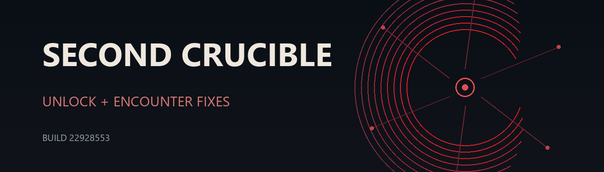

# Crucible Unlock for No Rest for the Wicked

[](README.zh-CN.md)

Unlock the **second Echo / second Crucible**, with encounter fixes and multiplayer support.



**[Download on Nexus Mods](https://www.nexusmods.com/norestforthewicked/mods/108)** · [Complete installation guide](#download-and-installation) · [Watch gameplay](#gameplay-demonstration)

Version **`0.8.6-boss-order`** · Tested on **Steam public Build 22928553** · Unofficial community mod

## Contents

- [Features](#features)
- [Multiplayer and revival](#multiplayer-and-revival)
- [Gameplay demonstration](#gameplay-demonstration)
- [Download and complete installation guide](#download-and-installation)
  - [Preparation and version requirements](#install-prepare)
  - [Step 0: Close the game and back up saves](#install-backup)
  - [Step 1: Find the game directory and check the build](#install-locate)
  - [Step 2: Install MelonLoader](#install-loader)
  - [Step 3: Extract and place the Mod DLL](#install-files)
  - [Step 4: Set all three required options](#install-config)
  - [Step 5: Launch and verify loading](#install-verify)
  - [ZIP and DLL checksums and completion checklist](#install-checksums)
  - [Troubleshooting](#install-troubleshooting)
  - [Uninstalling and updating](#install-uninstall)
  - [Install with an AI agent](#install-agent)
- [Compatibility and safety](#compatibility-and-safety)
- [Technical details and building](#technical-details-and-building)
- [License](#license)

## Features

- **Access the second Crucible.** The unlock is active only while the mod is loaded. It does not permanently complete a quest or directly edit a save.
- **Play the existing encounter sequence.** The mod reuses the game's encounters and repairs the second offering bowl, floor blood route, room progression, Boss content selection, and Warrick's second phase.
- **Play in multiplayer.** When the surviving team members defeat a floor's Boss, teammates who died during that Boss fight can revive and rejoin.

## Multiplayer and revival

Supports multiplayer. When the surviving team members defeat a floor's Boss, teammates who died during that Boss fight revive with **50% of their own maximum HP**.

## Gameplay demonstration

See the mod in action:

**[▶ Watch on YouTube](https://www.youtube.com/watch?v=Rw-hCcjvWss)** · **[▶ Watch on Bilibili](https://www.bilibili.com/video/BV1zbHH6EEGx)**

## Download and installation

This guide is for Windows/Steam players installing a mod manually for the first time. It covers **Second Crucible Unlock and Encounter Fixes (0.8.6)**, available from [Nexus Mods](https://www.nexusmods.com/norestforthewicked/mods/108?tab=files). The complete instructions from the original detailed Chinese guide are included below; you can also read the standalone [Chinese Markdown guide](INSTALL.zh-CN.md) or [HTML guide](INSTALL.zh-CN.html). Use the released mod ZIP. Do not mistake GitHub's source-code ZIP for the installation package, and do not use the old `0.4.0` package.

> **Read this first:** **Do not simply put the downloaded ZIP in the game directory and launch the game**, and do not put the whole ZIP in `Mods`. Extract it first, then make sure the file ends up at `game installation directory\Mods\CrucibleUnlock.dll`.

<a id="install-prepare"></a>

### What you need

- The Windows Steam version of **No Rest for the Wicked**. This release has only been verified against **Steam public Build 22928553**. After a game update, wait for a compatible mod release; do not bypass the version check.
- The ZIP downloaded through **Main files → Crucible Unlock 0.8.6 → Manual download** on the [Nexus Mods files page](https://www.nexusmods.com/norestforthewicked/mods/108?tab=files).
- A compatible **MelonLoader 0.7.x** release. The author's tested setup uses 0.7.3 x64. Get it from the [official MelonLoader releases page](https://github.com/LavaGang/MelonLoader/releases) or use the [official installer](https://github.com/LavaGang/MelonLoader.Installer). Do not download it from unknown mirror sites.
- A tool that can extract ZIP files. Windows File Explorer's built-in **Extract All** is sufficient.

The mod ZIP **does not include MelonLoader or game files**. MelonLoader is the loader that must be installed first; the mod's only in-game file is `CrucibleUnlock.dll`.

<a id="install-backup"></a>

### Step 0: Exit the game and back up your saves

1. Exit the game normally and confirm that Steam no longer shows it as **Running**. Wait for Steam downloads and cloud sync to finish. Do not leave the game running during installation or updates.
2. Press `Win + R`, paste the following path, and press Enter:

   ```text
   %USERPROFILE%\AppData\LocalLow\Moon Studios\NoRestForTheWicked
   ```

3. **Copy** the `DataStore` folder inside it to your desktop or another backup location **outside the game directory**. Leave the original folder unchanged after copying; do not move or cut it. If you also use Steam Cloud saves, wait for Steam to finish syncing first. A suggested backup name is `NRFW-save-backup-date-time`; check that the backup actually exists.
4. If the game has never run on this computer, there may not be a `DataStore` folder yet. Record that there are **no existing saves** and continue. Do not move, overwrite, or delete saves to create a backup.

The backup protects against unexpected problems with the loader, game updates, or normal gameplay. This mod does not directly edit saves to permanently complete the second Echo, but normal gameplay still saves progress. Removing the mod does not roll back those changes made during normal play.

<a id="install-locate"></a>

### Step 1: Find the actual game installation directory

In your Steam library, right-click **No Rest for the Wicked** → **Manage** → **Browse local files**. The folder that opens is the **game installation directory** referred to below. There is no need to guess a drive letter; Steam library locations vary from computer to computer.

Confirm that this folder contains `NoRestForTheWicked.exe` and `NoRestForTheWicked_Data`. For example, the game might be installed at:

```text
D:\SteamLibrary\steamapps\common\NoRestForTheWicked\
```

This path is only an **example**; you do not have to use drive D. The `Mods`, `MelonLoader`, and `UserData` folders mentioned below must all be directly inside the game installation directory you found.

**Check the Steam version:** Find `appmanifest_1371980.acf` in the `steamapps` directory of the same Steam library. Open it in Notepad for reading only and find `"buildid"`. Its value must be `22928553`; also confirm that you are using the `public` branch. If you have multiple Steam libraries, use the manifest's `installdir` value together with the actual game executable to identify the directory. If the version does not match, stop the installation and wait for a compatible release. Do not downgrade the game, modify its original files, or bypass the guard.

**Optional: Check the original game files.** Run the following read-only command in Windows PowerShell, replacing the example with the actual full path:

```powershell
Get-FileHash -Algorithm SHA256 -LiteralPath 'actual full path'
```

The version guard in this release expects these SHA-256 values:

| Original game file | Expected SHA-256 |
|---|---|
| `<game directory>\GameAssembly.dll` | `5B00EE90833B1BE2EA73E01CB83E710E09E86199D12AC769BE3C0E82ADD8B4BB` |
| `<game directory>\NoRestForTheWicked_Data\il2cpp_data\Metadata\global-metadata.dat` | `4C8DFE07E5F5178F8EEFD3D079412EC164EBA5DA798EFD2A2AE03AA37DC79502` |

If you choose to check these files, stop if either hash does not match. Do not modify original game files to make their hashes “match.”

<a id="install-loader"></a>

### Step 2: Install MelonLoader (skip to Step 3 if it is already installed)

The [official MelonLoader installer](https://github.com/LavaGang/MelonLoader.Installer) is recommended. Open it and select **No Rest for the Wicked**. If the game is not listed automatically, use the installer's **Add Game Manually** option to point it to the game. Select and install a compatible **0.7.x** release. See the installer's [instructions](https://github.com/LavaGang/MelonLoader.Installer#melonloader-installation) for game selection and installation.

**You can also manually install the tested 0.7.3 x64 release:**

1. Open the [official MelonLoader v0.7.3 release page](https://github.com/LavaGang/MelonLoader/releases/tag/v0.7.3) and download the Windows x64 manual installation package, `MelonLoader.x64.zip`.
2. In your **Downloads** folder, right-click the loader ZIP → **Extract All**. Check the extracted contents and the destination directory.
3. Preserve the official package's directory structure and place the loader files at the **root of the game installation directory**, alongside `NoRestForTheWicked.exe`. Do not put them in `Mods`.
4. Before copying, check the destination for files with the same names. If a loader is already installed or other files would be overwritten, confirm their source and version before deciding how to update. Do not overwrite them without checking.

After installation, check that a `MelonLoader` folder exists in the game installation directory. The MelonLoader 0.7.3 installation tested for this release also created `version.dll` alongside the game executable. File lists can vary between installation methods, so **do not judge installation success by whether `dobby.dll` exists**. The final confirmation is that the startup log shows the actual loader version, such as `MelonLoader v0.7.3 Open-Beta`, and the loader runs correctly.

When installing the loader for the first time, launch the game once through Steam so it can generate the IL2CPP interop assemblies and configuration files. This launch may take longer than usual. Once you reach the main menu, exit normally before continuing. If the loader does not start successfully, check its installation location and logs before proceeding with the mod installation. Do not copy or replace a mod DLL while the game is running.

This section describes the manual installation process for players. If an AI agent is helping under the [installation task brief](AGENT-INSTALL.zh-CN.md), it can place the loader, mod, and configuration files first and complete the offline checks; you then perform the first launch and verification yourself. The agent does not launch or control the game for you. The presence of files alone does not mean the loader has run.

<a id="install-files"></a>

### Step 3: Extract the Nexus Mods ZIP and place the DLL correctly

1. On the Nexus Mods files page, click **Manual download** under **Main files**. If you are asked to choose a download method, follow the page's instructions to finish downloading.
2. Open the Windows **Downloads** folder and find the downloaded `.zip`. Right-click it and select **Extract All**. You can temporarily extract it into your Downloads folder.
3. Open the extracted folder. The package should contain:

   ```text
   ZIP extraction directory\
   ├── Mods\
   │   └── CrucibleUnlock.dll
   ├── CHANGELOG.md
   ├── INSTALL.md
   └── SHA256SUMS.txt
   ```

4. Before copying, check this release's ZIP and extracted DLL using the [file verification instructions](#install-checksums) below. Stop the installation if the results do not match. Open the extracted `Mods` folder and **copy** `CrucibleUnlock.dll`.
5. Return to the **game installation directory** opened in Step 1. Open its `Mods` folder. If there is no such folder, create one directly inside the game installation directory and name it exactly `Mods`. Paste the DLL into it.
6. Finally, check the full location:

   ```text
   <your game installation directory>\Mods\CrucibleUnlock.dll
   ```

For example, if your game executable is at `D:\SteamLibrary\steamapps\common\NoRestForTheWicked\NoRestForTheWicked.exe`, the DLL belongs at `D:\SteamLibrary\steamapps\common\NoRestForTheWicked\Mods\CrucibleUnlock.dll`.

`CHANGELOG.md`, `INSTALL.md`, and `SHA256SUMS.txt` are documentation and verification files. They **do not need** to go into `Mods`. The complete extracted folder does not need to go into the game directory either.

**Common incorrect locations:**

```text
Incorrect: <game directory>\Mods\CrucibleUnlock-0.8.6-boss-order.zip
Incorrect: <game directory>\CrucibleUnlock-0.8.6-boss-order\Mods\CrucibleUnlock.dll
Incorrect: <game directory>\Mods\Mods\CrucibleUnlock.dll
Correct:   <game directory>\Mods\CrucibleUnlock.dll
```

If `Mods` already contains an older `CrucibleUnlock.dll`, exit the game first, copy the old file to a backup location **outside the game directory**, and then put the new version in place. Do not keep old and new Crucible Unlock DLLs together under different names.

<a id="install-config"></a>

### Step 4: Set all three required options

Open `UserData\MelonPreferences.cfg` inside the game installation directory. You can right-click the file → **Open with** → **Notepad**. If there is no `UserData` folder, create it in the game installation directory. If the configuration file is missing, create a UTF-8 plain-text file in that folder and name it `MelonPreferences.cfg`. For a manual installation, first confirm that the loader starts correctly as described in Step 2. During an agent-assisted offline installation, the file can also be created in advance; check it again after the first run. Enable **File name extensions** in File Explorer first so that you do not accidentally create `MelonPreferences.cfg.txt`.

Find `[CrucibleUnlock]` in the file. If this heading already exists, **edit the corresponding keys under that same heading**; do not add a second `[CrucibleUnlock]`. If it is entirely absent, go to the end of the file, leave a blank line, and add:

```ini
[CrucibleUnlock]
mode = "runtime-unlock"
guard_broken_warrick_music = true
repair_warrick_phase2_target = true
```

If the configuration file contains settings for other mods, **keep them** and change only these three options for this mod. Save the file, then reopen it and check: `runtime-unlock` must have straight double quotes around it; both `true` values must be unquoted and must not be `false`. The two options related to the first boss default to `false` when omitted, so setting only `mode` is not enough.

The final directory structure should look approximately like this. Additional game or loader files are normal:

```text
NoRestForTheWicked\                 ← Game installation directory; the drive letter may differ
├── NoRestForTheWicked.exe
├── NoRestForTheWicked_Data\
├── MelonLoader\                    ← Loader
├── version.dll                     ← Loader file present in the tested installation
├── Mods\
│   └── CrucibleUnlock.dll          ← This mod goes here
└── UserData\
    └── MelonPreferences.cfg        ← The three settings go here
```

<a id="install-verify"></a>

### Step 5: Launch the game and confirm successful loading

Launch the game normally through **Steam**. After reaching the main menu, you can exit and open this file in Notepad:

```text
<game installation directory>\MelonLoader\Latest.log
```

Use `Ctrl + F` in the log to look for each of these strings:

```text
Crucible Unlock 0.8.6-boss-order 已加载
mode = runtime-unlock
guard_broken_warrick_music = True
repair_warrick_phase2_target = True
[runtime-unlock] build guard passed
[runtime-unlock] installed two targeted read overrides
```

Also search for `MelonLoader` and confirm that the log shows the actual version, such as `MelonLoader v0.7.3 Open-Beta`. `0.7.x` denotes the version family; do not search for it as a literal log string.

These entries confirm that the DLL, configuration, game-version check, and temporary unlock patch have loaded. Seeing only “已加载” (“loaded”), without `build guard passed` or the entry for the two read overrides, **does not establish a successful installation**. The log may contain other entries or show them in a different order; what matters is that these key entries are present.

Next, go to the second Echo's sacrificial bowl in the game and test it yourself. The unlock works only while the mod is loaded correctly; it does not permanently mark the corresponding quest step as completed.

If the first run rewrites the configuration, fully exit the game, reopen the configuration file, and check all three values. Distinguish these three results: having the DLL in the correct directory confirms file placement only; having every required log entry confirms successful runtime loading; confirming that sacrifices, bosses, and subsequent floors work requires your own in-game testing.

<a id="install-checksums"></a>

### File verification: Check this release's 0.8.6 ZIP and DLL

The SHA-256 of this release's main ZIP on Nexus Mods is:

```text
F3733D6DF54D4E515D5810DC3B0B6657D86FB1850430493FF62ECAB45C9E22CF
```

To check it, open PowerShell from an empty area of your Downloads folder and enter `Get-FileHash` with the full path to the ZIP you downloaded, for example:

```powershell
Get-FileHash -Algorithm SHA256 -LiteralPath 'C:\Users\your-username\Downloads\CrucibleUnlock-0.8.6-boss-order.zip'
```

The browser's saved filename may contain extra text or numbers added automatically by Nexus Mods. **Replace the example with the actual filename you downloaded.** Only this exact release package should match the hash above; ZIPs from future updates will have different hashes.

After extraction, also check `Mods\CrucibleUnlock.dll`. Its SHA-256 must be:

```text
F456A46C79A8F9C272946BB00BD555D127FFE770E1EDD7D757B44F6EDA5472CC
```

```powershell
Get-FileHash -Algorithm SHA256 -LiteralPath 'your extraction directory\Mods\CrucibleUnlock.dll'
```

You can right-click a file in File Explorer and select **Copy as path**, then replace the example inside the command's quotes with the actual path. **If either hash does not match, stop the installation and check whether you selected the wrong file.** These values apply only to this `0.8.6` release package. Future packages will differ; use the new instructions for the corresponding version, and do not ignore a mismatch and continue installing.

**Offline installation checklist:**

- [ ] Steam is on `public` Build `22928553`, and the game directory has been located through Steam
- [ ] Any existing `DataStore` has been copied outside the game directory and the copy checked; if there are no saves, that has been recorded
- [ ] Compatible official MelonLoader files are in the game root directory; the version tested for this release is `0.7.3 x64`
- [ ] The SHA-256 values of this release's Nexus ZIP and extracted DLL both match
- [ ] There is only one version of the mod DLL, at `Mods\CrucibleUnlock.dll`
- [ ] The configuration contains only one `[CrucibleUnlock]` section, and all three settings have been saved and checked by reopening the file

After completing the offline checklist, you still need to launch the game, inspect the log, and test in-game yourself as described in [Step 5](#install-verify).

<a id="install-troubleshooting"></a>

### Troubleshoot by symptom

| Symptom | What to check first |
|---|---|
| You cannot find the game folder | Open it again through Steam's **Manage → Browse local files**. Do not copy the example drive-D path literally. |
| There is no MelonLoader log | Confirm that the loader is alongside the game executable and that you have launched the game once through Steam. |
| The game installation directory has no `Mods` or `MelonLoader` folder | Install MelonLoader as described in Step 2, and confirm that it points to the directory containing the game's `.exe`. |
| `Mods` contains only a ZIP, with no `CrucibleUnlock.dll` | The ZIP has not yet been extracted and its DLL copied as described in Step 3. |
| The log does not contain `Crucible Unlock 0.8.6-boss-order 已加载` | Check the DLL's full path, whether the loader started, and whether you accidentally downloaded an older archive. |
| The log shows `mode = probe` | The configuration was not saved to the correct `UserData\MelonPreferences.cfg`, or there is a duplicate `[CrucibleUnlock]` section. Check the file extension. |
| Both repair options are `False` in the log | Explicitly set both to `true` in the same `[CrucibleUnlock]` section as described in Step 4. Save, then fully exit and restart the game. |
| The version guard fails in the log, or there is no `build guard passed` entry | Confirm that the Steam public Build is **22928553**. You can also check the two original game-file hashes listed above without modifying the files. After a game update, wait for a compatible mod release. Do not bypass the check. |
| The DLL loads, but the second Echo does not unlock | Check for `runtime-unlock` and `installed two targeted read overrides`, then test at the correct second Echo entrance. |
| The first launch is very slow | MelonLoader may be generating IL2CPP assemblies. Let it finish, then assess the result using the log. |

When troubleshooting, you can provide the author with **relevant log excerpts**, but review them before sharing and redact personal usernames, disk paths, account details, and private configuration belonging to other mods. Include the game Build, MelonLoader version, mod ZIP version, and the exact step where you got stuck. This makes the issue easier to diagnose than simply saying “it doesn't work.”

<a id="install-uninstall"></a>

### Uninstalling and updating

- **Uninstall only this mod:** Exit the game, then delete or move out `Mods\CrucibleUnlock.dll`. You can keep other mods and the loader. You can also leave the `[CrucibleUnlock]` configuration section in place; it cannot activate a DLL that has been removed.
- **Update this mod:** Exit the game, back up the old DLL, and put the DLL from the new release package in the same location. Check the new release notes for any required configuration changes. Do not replace the DLL while the game is running.
- **Uninstall MelonLoader:** If other installed mods depend on it, deal with those mods first. Follow the [official MelonLoader uninstallation instructions](https://github.com/LavaGang/MelonLoader#un-install) for the exact procedure. Do not delete the entire `Mods`, `UserData`, or save directory just to uninstall this mod.

### Standalone installation guides

- **[English player guide](INSTALL.md):** installation, configuration, verification, and removal
- **[Detailed Simplified Chinese guide](INSTALL.zh-CN.md):** Windows and Steam walkthrough, ZIP placement, checks, and troubleshooting
- **[Standalone Chinese HTML guide](INSTALL.zh-CN.html):** save it and open it locally in a browser

<a id="install-agent"></a>

### Install with an AI agent

On a Windows PC with Steam, the official game, and an AI agent client, you can use the **[AI agent installation brief (Simplified Chinese)](AGENT-INSTALL.zh-CN.md)** with DSH, Codex, WorkBuddy, or Doubao desktop. No preinstalled Git, Python, .NET SDK, or Mod tools are required. The agent handles installation and offline checks; you launch and verify the game yourself.

**Operating boundaries for the agent:** Download only from the specified official Nexus and MelonLoader sources. Inspect original game files, Steam manifests, saves, and logs read-only; copy saves for backup without changing the originals. Add the loader, Mod DLL, and configuration as described in the brief. Stop and report existing same-name files or mismatched versions or hashes; do not overwrite blindly or modify game DLLs, metadata, or resource packages. Complete sign-in, CAPTCHA, payment, or download confirmations yourself as required by the brief; do not share passwords or session tokens. The agent must not launch the game or send game inputs.

**Ask the agent to report these actual results:**

```text
Steam Build / branch:
Game root directory:
Save backup: path, or "no existing saves"
MelonLoader: version, official source, key files added; whether runtime verification is still pending
Nexus ZIP: actual filename, source, SHA-256
Mod DLL: actual installation path, SHA-256
Configuration: the three values read back from the file
Offline result: ready / blocked step and reason
Still for you to complete: launch through Steam, exit after reaching the main menu, check logs and the second Crucible in-game
```

Report actual paths and verification results without posting full personal logs or account information. Files being installed does not mean the game has been verified. If the first launch rewrites the configuration, close the game and read it back again.

**Ready-to-copy installation prompt:**

```text
Please help me install the second Echo Mod for No Rest for the Wicked on this Windows PC. First open and read the full GitHub installation brief: https://github.com/Venompool888/nrfw-second-crucible-unlock/blob/main/AGENT-INSTALL.zh-CN.md . Then actually carry out the download, version check, save backup, installation, and offline verification described there; do not just summarize the guide. This PC currently has only Steam, the official game, your AI agent client, and possibly Chrome; Git, Python, the .NET SDK, and Mod tools are not preinstalled. Obtain files only from the official sources specified in the brief. If a page requires me to sign in, solve a CAPTCHA, or download manually, tell me exactly what to do and continue afterward. Do not launch or operate the game for me; I will perform in-game verification myself. Stop and report if the game version or file hashes do not match, or if existing files would be overwritten. Finish by listing the actual installation paths, verification results, and steps I still need to complete.
```

## Compatibility and safety

- **Tested scope:** one full nine-floor run on 2026-10-05 on Steam public **Build 22928553** showed the seven expected Boss encounters, checkpoint, reward room, and return to the second bowl. This is one tested run on one build, not a compatibility guarantee for later builds. Other game builds and repeated reload scenarios remain unverified. See the [version history](CHANGELOG.md).
- **Save behavior:** the unlock exists only while the mod runs. Normal play can still save progress; the mod does not write permanent quest completion.
- **Updates and removal:** never replace the DLL while the game is running. To uninstall, close the game and remove `Mods/CrucibleUnlock.dll`; remove MelonLoader separately if desired. See the [player guide](INSTALL.md).
- **Old builds:** do not use the old `0.4.0` archive or its persistent-unlock instructions from the research workspace.

## Technical details and building

The source under [`src/`](src/) is the frozen **`0.8.6-boss-order`** source snapshot.

- The mod checks the **exact supported game build** before installing its runtime hooks.
- Building requires MelonLoader references and game-specific generated IL2CPP interop assemblies from the supported game.
- The game, MelonLoader binaries, and generated interop assemblies are **not included**.

See **[BUILD.md](BUILD.md)** for local requirements, build commands, tests, and packaging.

## License

The code is available under **[MIT](LICENSE-CODE.md)**. The six image data files under `src/CrucibleUnlock/Assets/SecondBowlBlood/` are outside that code license; see the license file for its full scope.

This is an **unofficial community project**.

